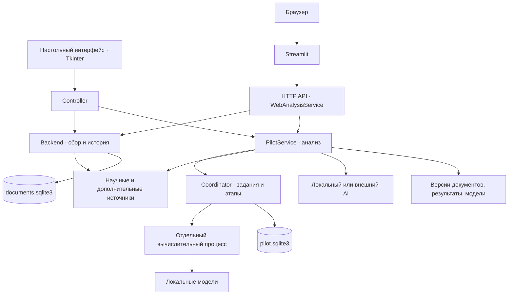

# Trendanalyser — техническая документация и пояснительная записка

Единое описание назначения, устройства, установки, HTTP API и сопровождения проекта.
Документ сверен с исходным кодом на **29 сентября 2026 года**.
Репозиторий: [fellichita/TEMA](https://github.com/fellichita/TEMA).

## Содержание

1. [Назначение и возможности](#purpose)
2. [Технологический стек](#stack)
3. [Структура проекта](#structure)
4. [Архитектура и ход анализа](#architecture)
5. [Источники и границы данных](#sources)
6. [Модели, методика и оценка качества](#models)
7. [Хранение и обмен результатами](#storage)
8. [Установка на macOS, Windows и Linux](#installation)
9. [Локальный веб-интерфейс](#local-web)
10. [Временный публичный доступ](#public-web)
11. [Настройки окружения](#environment)
12. [HTTP API](#api)
13. [Обновление и резервирование](#maintenance)
14. [Проверки и сопровождение](#checks)
15. [Типичные проблемы](#troubleshooting)
16. [Дополнительные материалы](#references)

<a id="purpose"></a>

## Назначение и возможности

**Trendanalyser** помогает исследовать технологическое направление по научным
публикациям и дополнительным источникам: собрать материалы, выделить кандидатов,
проверить их динамику и происхождение, рассмотреть доказательства и сохранить
результат. Программа предназначена для аналитической работы и экспертной проверки
гипотез о слабых сигналах и формирующихся технологиях.

| Сценарий | Что реализовано |
| --- | --- |
| Настольная работа | Tkinter-интерфейс, сбор и история публикаций, научный анализ, просмотр карточек и первоисточников, настройки, импорт/экспорт и резервные копии. |
| Работа в браузере | Streamlit-интерфейс, быстрый и глубокий анализ, прогресс, история, публикации, радар технологий и перевод. |
| Работа владельца веб-сервиса | Отдельная локальная панель: очередь, ресурсы, источники, посетители, сравнение анализов и обучение по отметкам релевантности. |
| Анализ сохранённого корпуса | Отдельный режим `app/ml`: TF-IDF/NMF, необязательная смысловая проверка, воспроизводимый CLI и JSON-результат. |
| Обмен результатами | Научные пакеты `.trendresult`, JSON отдельного ML-режима, пакеты профилей нескольких источников и резервные копии библиотеки. |
| Программный доступ | Внутренний HTTP API для локального серверного клиента; маршруты и ограничения описаны ниже. |

В веб-интерфейсе пользователь задаёт тему и режим `fast`/`deep`; настольный анализ
использует тему и сохранённые настройки. Вывод — карточки кандидатов,
публикации, показатели покрытия, доказательства, причины ограничений и сведения
о расчёте. Веб-режим дополнительно формирует радар и переводы. Отдельный ML-режим
принимает сохранённый корпус или идентификатор исторической выборки.

Обычный сценарий: подготовить окружение и модели → запустить интерфейс → проверить
настройки AI и источников → ввести тему → дождаться результата → изучить карточки,
ограничения и источники → сохранить результат. Возможности разных интерфейсов
различаются; общий научный сервис и форматы данных используются совместно.

Проект передаётся как **исходный код**. В репозитории сохранены проверочные корпуса
и небольшие параметры классификатора; большие веса устанавливаются отдельно.
Нативные установщики приложения не выпускаются текущими workflow.

<a id="stack"></a>

## Технологический стек

Версии ниже взяты из файлов зависимостей проекта; это описание закреплённого
окружения, а не перечень последних доступных выпусков библиотек.

| Область | Технологии |
| --- | --- |
| Язык и runtime | CPython 3.13; в CI закреплён 3.13.15. |
| Настольный интерфейс | Tkinter / ttk, Tcl/Tk выбранной установки Python. |
| Веб-интерфейс | Streamlit `>=1.64,<2`, requests `>=2.32.4,<3`; отдельное окружение `.venv-web`. |
| Внутренний API | Стандартные `http.server.ThreadingHTTPServer`, JSON и фоновые задания Python. |
| Контракты и сеть | Pydantic 2.13.5, httpx 0.28.1, defusedxml 0.7.1. |
| Расчёты и классическое ML | NumPy 2.5.2, SciPy 1.18.1, scikit-learn 1.9.0; TF-IDF, NMF, HDBSCAN, логистическая регрессия. |
| Локальный inference | ONNX Runtime 1.29.0, tokenizers 0.23.2; E5, OPUS-MT и Qwen. CPU runtime, необязательный CUDA runtime. |
| Хранение | SQLite 3.53.4 через частный wheel `pysqlite3==0.6.0+sqlite3.53.4`, JSON-артефакты, ZIP-пакеты с манифестами. |
| Ключи и PDF | keyring 25.7.0, pypdf 6.18.0. |
| Разработка | pytest, Ruff, mypy, отдельный аудит зависимостей; Node.js 24 для браузерных проверок. |
| Автоматизация | GitHub Actions: Linux, macOS arm64 и Windows x64; Docker-окружение для Linux-проверок. |

Зависимости разделены по назначению в [`requirements/`](../requirements/README.md):
`base` → `ml` → `semantic` → `pilot`; отдельно `web`, `dev`, `native-build`, `audit`
и необязательный `cuda`. Файлы `.lock` закрепляют версии. `web.txt` использует
диапазоны, поэтому не задаёт полностью фиксированное веб-окружение. Конфигурация
pytest, Ruff и mypy находится в [`pyproject.toml`](../pyproject.toml).

<a id="structure"></a>

## Структура проекта

```text
app/                       Код приложения
├── backend/               Источники, сбор публикаций, хранение и история
├── ml/                    Отдельный анализ сохранённого корпуса
├── pilot/                 Основной научный анализ, доказательства и отчёты
│   ├── approved_sources/  Дополнительные источники
│   └── multisource/       Профили сигналов из разных источников
├── radar/                 Радар и паспорта технологий
├── runtime/               Задания, модели, ключи, процессы и резервные копии
├── signal_model/          Классификатор слабых сигналов и его оценка
├── ui/                    Tkinter, Streamlit, шрифты и стили
├── main.py                Точка входа настольного приложения
├── web_api.py             HTTP API и сервис веб-анализа
├── web_admin.py           Управление веб-сервисом
├── web_monitor.py         Мониторинг посетителей и событий
├── analysis_index.py      Индекс, фильтры и сравнение анализов
└── relevance_learning.py  Обучение релевантности по результатам и отметкам

launchers/                 Запускатели для пользователя
├── macos/                 Desktop, локальный веб и веб-демо
└── windows/               Веб-демо, панель владельца и настройка туннеля
requirements/              Наборы зависимостей
resources/models/          Реестр моделей и сведения об их лицензиях
scripts/                   Установка, запуск и обслуживание
tools/                     Проверки, диагностика и измерения
tests/                     Автоматические тесты и контрольные примеры
data/                      Входные материалы и сохранённые корпуса
├── imports/               Материалы для импорта
├── signal_model/          Отрицательные примеры классификатора
└── offline-storage/       Проверяемые архивы воспроизводимых корпусов
docs/                      Документация
├── documentation.md       Этот единый документ
├── architecture/          Подробности отдельных подсистем
├── guides/                Практические руководства
├── methodology/           Методики и отчёты об оценке
├── reference/             Задание проекта и каталог источников
├── schemas/               Схемы отдельных форматов
└── design/                Оформление интерфейсов
.github/workflows/         Проверки на трёх ОС
pyproject.toml             Настройки инструментов разработки
README.md                  Краткое описание и вход в документацию
```

Названия Python-модулей следуют `snake_case`, Markdown-документов — `kebab-case`.
`scripts/` содержит команды эксплуатации, `tools/` — инструменты разработчика.
При добавлении функции выбирайте модуль по ответственности из таблицы архитектуры.

Локально создаются `.venv/`, `.venv-web/`, `storage/` и `build/`: окружения,
модели/рабочие профили, исходники SQLite, его wheel и отчёты проверок. Эти данные
исключены из Git. `build/wheels/` нужен для зависимости SQLite и не является
дистрибутивом приложения. Обычная пользовательская библиотека хранится отдельно
от репозитория. Наличие папки в рабочей копии не означает, что она входит в Git.

<a id="architecture"></a>

## Архитектура

Trendanalyser — Python-приложение с общим ядром анализа и несколькими точками входа.
Настольный интерфейс обращается к ядру через контроллер, веб-интерфейс — через локальный
HTTP API. Веб-сервис использует тот же формат профиля и те же классы `Backend` и
`PilotService`. Для одного каталога данных действуют блокировки: независимые экземпляры
приложения не должны одновременно владеть одной библиотекой.



### Зоны ответственности

| Модуль | Ответственность |
| --- | --- |
| [`app/backend/`](../app/backend/) | Адаптеры Crossref, OpenAlex и EPO OPS; сбор документов, дедупликация и версии записей; задания сбора и исторические выборки в SQLite. |
| [`app/pilot/service.py`](../app/pilot/service.py) | Полный анализ запроса: план поиска, корпус, кандидаты, история, доказательства, оценка, сохранение; также уточнение кандидатов, экспертная проверка, импорт и экспорт. |
| [`app/pilot/contracts.py`](../app/pilot/contracts.py) | Строгие Pydantic-контракты плана, снимков корпуса, карточек, цитат и результата. Проверяют структуру и согласованность ссылок. |
| [`app/runtime/`](../app/runtime/) | Долговечные задания, отмена, бюджет запросов, изолированные вычисления, ключи доступа, модели, резервное копирование. |
| [`app/ml/`](../app/ml/) | Анализ сохранённого корпуса или исторической выборки: базовый NMF и режим смысловой проверки. Имеет отдельный CLI и JSON-экспорт. |
| [`app/radar/`](../app/radar/) | Радар технологий: извлечение устойчивых фраз, история упоминаний, паспорт технологии, оценка и журнал исключённых кандидатов. |
| [`app/signal_model/`](../app/signal_model/) | Интерпретируемая логистическая регрессия для слабых сигналов: признаки, обучение, оценка и сохранённые численные параметры. |
| [`app/pilot/multisource/`](../app/pilot/multisource/) | Профиль сигналов из научного результата, arXiv, поискового внимания Wordstat и данных о финансировании; происхождение и правила сопоставления хранятся отдельно. |
| [`app/ui/controller.py`](../app/ui/controller.py) | Связь Tkinter с сервисами. Разделяет управление, чтение документов и тяжёлые операции по фоновым потокам; возвращает ответы в цикл Tkinter. |
| [`app/web_api.py`](../app/web_api.py), [`app/ui/web.py`](../app/ui/web.py) | HTTP API и браузерное представление результатов. Веб-очередь, представление прогресса, перевод и досчёт радара находятся поверх общего ядра. |
| [`app/web_admin.py`](../app/web_admin.py), [`app/web_monitor.py`](../app/web_monitor.py) | Инструменты владельца: источники, ресурсы, наблюдение за работой сервиса и обратная связь по релевантности. |

`Coordinator` сохраняет входные параметры, состояние запуска и ссылки на завершённые
этапы. Настольный режим по умолчанию выполняет один анализ; веб-сервис может допускать
до четырёх одновременных анализов. Это ограничение реализации, а не гарантия скорости.
Тяжёлые вычисления запускаются через [`runtime/worker.py`](../app/runtime/worker.py):
процесс получает файлы входа, пишет ограниченный по размеру результат и поддерживает
отмену и таймаут. Соединения с базами и хранилище ключей ему не передаются.

### Как проходит анализ

1. **Фиксация запроса.** Сохраняются исходный запрос, дата среза, настройки, выбранный
   режим, ограничения и политика источников. План задаёт английскую поисковую формулировку
   и границы темы; при необходимости используется перевод или AI.
2. **Сбор корпуса.** Crossref и OpenAlex возвращают публикации. Сохраняются версии
   документов и снимок выборки. Учитываются ограничения выдачи, ошибки источников,
   повторные версии исследований и известные статусы отзыва публикаций.
3. **Обнаружение кандидатов.** Многоязычный E5 оценивает смысловую близость;
   HDBSCAN выделяет группы. NMF служит явно отмечаемым запасным алгоритмом.
   Само наличие группы ещё не подтверждает появление нового тренда.
4. **Описание технологии.** Проверяются название, предметные границы и связь
   кандидата с исходными публикациями. Непроверенные и отклонённые гипотезы
   сохраняются в очереди с состоянием попытки.
5. **История и доказательства.** Для кандидатов собираются исторические наблюдения,
   проверяются более ранние аналоги, годовой фон направления, цитаты и сведения
   о первичных результатах. При включённой настройке добавляется патентный поиск.
6. **Расчёт оценки.** Версионированная методика рассчитывает компоненты и допуски;
   формирует категории, качество данных, ограничения и отбор в TOP.
7. **Проверка и публикация.** Перед сохранением проверяются ссылки, архивные цитаты
   и воспроизводимость расчётов. Завершённый запуск хранит результат и артефакты этапов.

Параллельно собираются дополнительные наблюдения и сведения NIH RePORTER,
строится радар технологий. Они имеют отдельное происхождение и покрытие.
Дополнительная новостная выдача не подмешивается в научный корпус и его исторический
знаменатель. В веб-режиме радар может завершиться после основного анализа;
интерфейс получает его обновлённое состояние отдельно.

В [`settings.py`](../app/pilot/settings.py) определены два профиля:

| Профиль | Публикации для обнаружения | Размер TOP | Кандидаты на проверку | История на кандидата / общая новая история | Патенты |
| --- | ---: | ---: | ---: | ---: | --- |
| `fast` | до 1 000 | до 8 | до 24 | 150 / 1 500 | выключены |
| `deep` | до 10 000 | до 15 | до 60 | 3 000 / 20 000 | включены |

Это бюджеты, а не обещанное число найденных материалов. Недоступность источника,
малое число подходящих публикаций и недостаток доказательств уменьшают результат.
Быстрый режим даёт предварительный обзор; TOP не дополняется до лимита неподтверждёнными карточками.

<a id="sources"></a>

## Источники и границы данных

Основной сбор реализован в [`backend/providers/`](../app/backend/providers/):
Crossref и OpenAlex — публикации, EPO OPS — патенты. Для EPO нужны учётные данные.
В текущем интерфейсе OpenAlex поддерживает необязательный ключ; фактические квоты
и доступность определяет внешний сервис.

Каталог [`approved_sources/catalog.py`](../app/pilot/approved_sources/catalog.py)
содержит 26 дополнительных адаптеров:

| Группа | Источники |
| --- | --- |
| Научные каталоги, препринты и архивы | arXiv, bioRxiv, OpenReview, Zenodo, Europe PMC, Semantic Scholar, DOAJ, КиберЛенинка, HAL, OSTI, NASA NTRS, dblp, ChemRxiv, OpenAIRE, J-STAGE |
| Новости | NIST News, MIT Research News, Horizon Magazine, GDELT, Google News |
| Код, модели и сообщества | GitHub, Hacker News, Хабр, Stack Overflow, Hugging Face, npm |

Владелец веб-сервиса может отключать адаптеры и выбирать страны источников.
Политика записывается в запуск; международное научное ядро Crossref/OpenAlex
этим фильтром не ограничивается. Поддержка адаптера означает наличие реализации,
а не гарантированную доступность или полноту выдачи конкретного сайта.

[`funding_sources.py`](../app/pilot/funding_sources.py) отдельно получает снимок
NIH RePORTER, ограниченный одной страницей до 50 записей. Проекты различаются по
механизму финансирования: грант/соглашение, контракт, внутренний проект и прочее.
Суммы в этом источнике нельзя автоматически трактовать как венчурные инвестиции
или уже выплаченные деньги.

Дополнительные локальные входы включают аналитические отчёты, arXiv Atom и CSV
для профилей сигналов. Для Wordstat есть отдельный API-адаптер, включаемый настройкой.
Импортируемые материалы сохраняют сведения о происхождении и разрешении на передачу;
наличие файла у пользователя само по себе не означает право распространения.

<a id="models"></a>

## Модели и методика

### Локальные модели

Файлы моделей устанавливаются отдельно от исходного кода. Спецификации закрепляют
ревизию, имена файлов, размеры и SHA-256; перед использованием проверяются артефакты.

| Назначение | Модель | Закреплённая ревизия | Спецификация |
| --- | --- | --- | --- |
| Многоязычные векторы научного анализа, 384 измерения | `intfloat/multilingual-e5-small`, FP32 ONNX | `614241f622f53c4eeff9890bdc4f31cfecc418b3` | [encoder-spec.json](../app/pilot/encoder-spec.json) |
| Перевод запроса с русского на английский | `Xenova/opus-mt-ru-en`, INT8 ONNX | `afe8c6c738ec81b6d033fd8f44f9678a639a7c67` | [translator-spec.json](../app/pilot/translator-spec.json) |
| Перевод материалов с английского на русский | `Xenova/opus-mt-en-ru`, INT8 ONNX | `e050376e960175e8ddc5cff85025dc8436cddd68` | [translator-en-ru-spec.json](../app/pilot/translator-en-ru-spec.json) |
| Локальный AI для плана и описания кандидатов | `onnx-community/Qwen2.5-1.5B-Instruct`, Q4 ONNX | `6287331f475a3e20e8c879be8fd4bf3551ad9d34` | [local-llm-spec.json](../app/pilot/local-llm-spec.json) |
| Смысловая проверка отдельного режима `app/ml` | `intfloat/e5-small-v2`, ONNX | `ffb93f3bd4047442299a41ebb6fa998a38507c52` | [encoder_spec.json](../app/ml/encoder_spec.json) |

Провайдер AI по умолчанию — `local`; также реализованы DeepSeek и Yandex.
Использование локальной модели устраняет передачу AI-запроса внешнему провайдеру,
но сбор новых публикаций по-прежнему обращается к интернет-источникам.
Без установленного локального AI сбор может завершиться с ограничениями:
непроверенные названия и границы технологий не дают кандидатам попасть в TOP.
Спецификация многоязычного энкодера прямо отмечает, что независимое сравнение
с исходной реализацией PyTorch не выполнено.

### Что означает оценка

Новый научный анализ использует **методику 3.4.0**, формат контрактов —
**`schema_version: 3`**. Поддерживаются сохранённые методики 3.0.0–3.4.0;
низкоуровневое значение по умолчанию 3.1.0 оставлено для совместимости старых вызовов.
Чтение старого анализа не пересчитывает его молча по новой методике.

[`methodology.py`](../app/pilot/methodology.py) рассчитывает рост, устойчивость,
новизну, независимость и применение. Неизвестные компоненты остаются неизвестными;
учитываются покрытие истории, происхождение цитат и правила допуска.
[`methodology-v3.4.json`](../app/pilot/methodology-v3.4.json) описывает правила версий
публикаций, контекстных цитат и сохранения состояний проверки гипотез.

Радар использует собственную политику `radar/1.3.0` и числовую модель
`weak-signal-logreg/1.0.0`, сохранённую в [`model.json`](../app/signal_model/model.json).
Логистическая регрессия выдаёт оценку своего класса по признакам паспорта.
Отдельная «уверенность в тренде» из [`trend_confidence.py`](../app/trend_confidence.py)
характеризует форму помесячной кривой найденных материалов. Её коэффициенты источников
заданы правилами проекта. Эти оценки не являются вероятностью коммерческого успеха.

Автоматические категории слабого сигнала и emerging — проверяемые гипотезы.
Проверки программы подтверждают заданное поведение, целостность и происхождение
расчётов; независимая предметная разметка нужна для измерения научной точности
и прогностической способности. Успешный запуск сам по себе такую оценку не заменяет.

### Оценка качества и границы выводов

Сохранённый [отчёт классификатора](methodology/signal-model-report.md) описывает
100 положительных примеров организаторов и 90 отрицательных примеров команды.
На этом наборе повторная пятичастная кросс-валидация с 10 повторами дала
F1 **0,994**; вариант только по тексту — **0,955**. Это результаты конкретного
набора и процедуры. Они не устанавливают точность на произвольном потоке новых
технологий и не подтверждают будущий коммерческий успех. Используются 12
интерпретируемых признаков, в том числе стадия, динамика, научная активность
и признаки зрелого рынка; словарные правила чувствительны к формулировкам.

Готовая модель `app/signal_model/model.json` входит в исходники. Исходный файл
организаторов `data/signal_model/dataset.xlsx` исключён из Git, поэтому для
повторного обучения нужен отдельно предоставленный набор в ожидаемом формате.
Команды и входную схему реализуют [`app/signal_model/__main__.py`](../app/signal_model/__main__.py)
и [`dataset.py`](../app/signal_model/dataset.py). Пример обучения с явными
выходными путями, чтобы сохранить поставляемую модель:

```sh
.venv/bin/python -m app.signal_model train --dataset /path/to/dataset.xlsx --model storage/retrained-signal-model.json --report storage/retrained-signal-report.md
```

Отдельная [`модель релевантности`](../app/relevance_learning.py) обучается на
сохранённых анализах и отметках владельца и помогает оценивать соответствие
публикации теме. Её настройки, обучение и сброс доступны в панели владельца.
Оценку релевантности, доверие к источнику, научный балл и вероятность класса
слабого сигнала следует интерпретировать раздельно.

Ограничения, влияющие на результат:

- Найденный корпус ограничен запросами, квотами, датами, языком и доступностью
  аннотаций. Отсутствие публикации в выдаче не доказывает отсутствие исследования.
- Рост числа упоминаний зависит от покрытия источников. Полнота помесячных
  свидетельств, даже равная 100%, не является вероятностью успеха технологии.
- AI может ошибаться в названии и границах темы; для проверки нужны ссылки,
  архивные версии и экспертное чтение первичных материалов.
- Перевод служит для чтения; оригинал публикации и его происхождение сохраняют
  самостоятельное значение.
- Пустой TOP допустим: недостаточные доказательства не превращаются в
  подтверждённый сигнал для заполнения списка.

<a id="storage"></a>

## Хранение, совместимость и обмен результатами

Пользовательская библиотека отделена от кода. Стандартный каталог профиля:

| ОС | Каталог |
| --- | --- |
| Windows | `%LOCALAPPDATA%\Trendanalizer Pilot main2` |
| macOS | `~/Library/Application Support/Trendanalizer Pilot main2` |
| Linux | `$XDG_DATA_HOME/Trendanalizer Pilot main2`, по умолчанию `~/.local/share/Trendanalizer Pilot main2` |

Старое написание `Trendanalizer` и суффикс `main2` в профиле намеренно сохранены
для совместимости. В [`identity.py`](../app/identity.py) также закреплены
`APP_ID=org.trendanalizer.pilot.main2` и пространство ключей
`Trendanalizer.Pilot.main2`. Их переименование требует отдельной миграции данных.
Файл `active-library.json` может указывать на выбранную существующую библиотеку.
Относительный `XDG_DATA_HOME` игнорируется. На Windows сетевые UNC-каталоги
для базы не поддерживаются. Параметр `--data-dir` явно выбирает библиотеку.

| Данные профиля | Назначение |
| --- | --- |
| `documents.sqlite3` | Документы, версии, идентификаторы, задания сбора и исторические выборки. |
| `pilot.sqlite3` | Запуски анализа, состояния этапов и журнал бюджета запросов. |
| `checkpoints/` | Неизменяемые JSON-артефакты этапов и результатов, связанные с запусками. |
| `revisions/` | Архив точных версий документов, на которые ссылаются доказательства. |
| `imported-results/`, `supplemental/` | Импортированные результаты и дополнительные материалы. |
| `signals/` | Объекты профилей сигналов, исходные CSV/XML/JSON и записи наблюдения. |
| `models/` | Установленные модели основного анализа, перевода и локального AI. |
| `settings.json`, `web-source-policy.json` | Настройки анализа и политика дополнительных источников. |
| `learning/` | Примеры, обратная связь, настройки и обученная модель релевантности публикаций. |
| `logs/diagnostics.log` | Диагностические события с ротацией журнала. |

Ключи доступа хранятся в памяти сессии или поддерживаемом системном хранилище;
они не должны попадать в настройки, результаты и репозиторий. Модуль
[`runtime/credentials.py`](../app/runtime/credentials.py) поддерживает постоянное
хранилище macOS Keychain и Windows Credential Manager; при недоступности защищённого
хранилища постоянная запись не заменяется незаметно открытым текстовым файлом.

Научный экспорт создаёт проверяемый ZIP-пакет формата `trendanalizer-result`:
`result.json`, `assessments.json`, при наличии `reviews.json`, необходимые
`revisions/` и манифест с размерами/хешами. Экспорт переносит научный результат;
полный веб-конверт с радаром и дополнительными наблюдениями в него не включается.
Режим `app/ml` сохраняет отдельный JSON. Профили нескольких источников используют
свой пакет `trendanalizer-signals`.

Резервная копия библиотеки имеет формат `trendanalizer-backup`; SQLite копируется
через механизм backup. В пакет входят две базы, связанные с ними артефакты научных
анализов и `settings.json`. Ключи, модели, каталог `learning/` с отметками владельца
и моделью релевантности, политика источников и служебные настройки веба, журналы
и кэши в этот пакет не входят. Восстановление выполняется в новый или пустой каталог,
с проверкой структуры, ссылок и содержимого. SHA-256 подтверждает целостность,
но не авторство архива. Реализация: [`runtime/backup.py`](../app/runtime/backup.py),
[`pilot/export.py`](../app/pilot/export.py), [`pilot/multisource/export.py`](../app/pilot/multisource/export.py).

<a id="installation"></a>

## Установка и запуск из исходников

### Системные требования

Текущий способ распространения — исходный код. Готовых установщиков и архивов приложения в репозитории нет. Нужны Git, обычный CPython **3.13** (не free-threaded), Tkinter и C-компилятор для частного SQLite-драйвера. Первичная установка библиотек и моделей требует интернета. Поиск новых публикаций также использует сеть; локальная AI-модель выполняет только свою часть анализа без внешнего AI API.

| ОС | Подготовка |
| --- | --- |
| macOS | Apple Silicon, macOS 14+, нативный arm64 Python 3.13 с Tkinter; Xcode Command Line Tools (`xcode-select --install`). Intel Mac не поддерживается закреплённым runtime ONNX. |
| Windows | Windows x64, Python 3.13 x64 с Tcl/Tk, Visual Studio Build Tools с MSVC C++ и Windows SDK. Команды ниже рассчитаны на PowerShell. |
| Linux | Python 3.13 с `venv`, заголовками разработки и Tkinter; C-компилятор; графическая сессия для desktop. CI использует Ubuntu 24.04. Установка одного `python3-tk` не добавляет Tk к отдельно собранному Python. |

Node.js 24 нужен для браузерных **тестов**, а не для обычного запуска. Для локального AI подготовьте место под примерно 1,8 ГБ Qwen, остальные модели, библиотеки и рабочие данные. Строгий минимум RAM и гарантированное время анализа для всех платформ не установлены; длительность зависит от модели, оборудования и доступности источников.

Все команды выполняются из корня проекта. Виртуальные окружения создаются на каждом компьютере заново; копировать `.venv` с другой машины нельзя.

```sh
git clone --branch main --single-branch https://github.com/fellichita/TEMA.git
cd TEMA
```

### macOS и Linux: ручная установка

Убедитесь, что `python3.13` соответствует указанным требованиям:

```sh
python3.13 -m venv .venv
.venv/bin/python -c 'import tkinter; print("Tk", tkinter.TkVersion)'
.venv/bin/python -m pip install --upgrade pip==26.2.1
.venv/bin/python -m pip install -r requirements/semantic.lock -r requirements/native-build.lock
.venv/bin/python -m scripts.build_sqlite_runtime
.venv/bin/python -m pip install -r requirements/pilot.lock
.venv/bin/python -m pip check
.venv/bin/python -m scripts.setup_models
.venv/bin/python -m scripts.install_local_llm
.venv/bin/python -m app.main
```

На macOS также доступен `bash launchers/macos/desktop.command`: он подготавливает `.venv` и запускает окно. Модели для настольного режима установите двумя командами `setup_models` и `install_local_llm` выше. `bash launchers/macos/desktop.command --install-only` подготавливает только окружение, `--check` проверяет его без установки и запуска окна.

### Windows: ручная установка

```powershell
py -3.13 -m venv .venv
.\.venv\Scripts\python.exe -c "import tkinter; print('Tk', tkinter.TkVersion)"
.\.venv\Scripts\python.exe -m pip install --upgrade pip==26.2.1
.\.venv\Scripts\python.exe -m pip install -r requirements/semantic.lock -r requirements/native-build.lock
.\.venv\Scripts\python.exe -m scripts.build_sqlite_runtime
.\.venv\Scripts\python.exe -m pip install -r requirements/pilot.lock
.\.venv\Scripts\python.exe -m pip check
.\.venv\Scripts\python.exe -m scripts.setup_models
.\.venv\Scripts\python.exe -m scripts.install_local_llm
.\.venv\Scripts\python.exe -m app.main
```

После каждой команды дождитесь успешного завершения. Активация окружения и изменение политики PowerShell не нужны. На Windows нет автоматического установщика настольной версии; файлы `launchers/windows/` запускают уже подготовленный веб-режим и его инструменты.

### Зачем отдельно собирается SQLite

`scripts.build_sqlite_runtime` скачивает закреплённые исходники SQLite **3.53.4** и `pysqlite3`, проверяет контрольные суммы и создаёт wheel **`pysqlite3==0.6.0+sqlite3.53.4`** в `build/wheels/`. `requirements/pilot.lock` устанавливает его через `--find-links build/wheels`. Поэтому порядок команд существенен: сначала `semantic.lock` и `native-build.lock`, затем сборка, затем `pilot.lock`. Системная SQLite не заменяется; готовый публичный `pysqlite3==0.6.0` не является эквивалентной зависимостью.

Проверка фактически загруженного runtime (на Windows используйте `.\.venv\Scripts\python.exe`):

```sh
.venv/bin/python -c 'from app.sqlite_runtime import sqlite3; print(sqlite3.sqlite_version)'
```

### Модели и настройки AI

- `scripts.setup_models` готовит **три** модели: `multilingual-e5-small` для научного анализа, `e5-small-v2` для смысловой проверки трендов, `opus-mt-ru-en` для перевода русского запроса.
- `scripts.install_local_llm` устанавливает Qwen2.5-1.5B-Instruct для текущего стандартного профиля. Провайдер нового профиля по умолчанию — `local`; без весов его анализ не готов к работе. Модель можно установить и кнопкой в настройках приложения.
- `scripts.setup_models --web-analysis --profile ПУТЬ` готовит **четыре** модели для веб-профиля: `multilingual-e5-small`, `opus-mt-ru-en`, `opus-mt-en-ru` для чтения результатов и Qwen2.5-1.5B-Instruct. Подготовка повторно использует проверенные файлы и скачивает отсутствующие.
- `--offline` у `setup_models` разрешает только использование локальных файлов; пропущенные или повреждённые модели приводят к неуспешному результату команды. Это не переключатель автономного поиска публикаций.

Версии, ревизии и SHA-256 моделей закреплены в JSON-спецификациях рядом с кодом и в `resources/models/registry.json`; веса в Git не входят. Для собственной библиотеки используйте один и тот же путь в `setup_models --profile ПУТЬ` и `app.main --data-dir ПУТЬ`; Qwen для неё удобно поставить через `setup_models --web-analysis --profile ПУТЬ`.

В настройках можно выбрать `local`, `deepseek` или `yandex`. Внешнему провайдеру нужны ключ, разрешение внешнего AI и настроенные лимиты расходов; Yandex также нужен идентификатор каталога. Значения тарифов в настройках требуют проверки перед реальным платным использованием. Ключи вводятся в интерфейсе: доступны память текущего сеанса и поддерживаемое системное хранилище. Постоянное хранилище реализовано для macOS и Windows; на Linux текущая реализация допускает только сеансовые ключи.

CPU — базовый сценарий. Необязательный CUDA runtime для Windows/Linux описан в [руководстве по локальному AI](guides/local-ai.md): CPU- и GPU-пакеты ONNX Runtime одновременно не устанавливаются, перед работой выполняется `scripts.check_cuda_runtime`. Наличие GPU не гарантирует ускорение или качество полного анализа.

### Автономный анализ сохранённого корпуса

Для воспроизводимого примера восстановите поставляемые корпуса и запустите
отдельный ML-конвейер. После установки зависимостей эти команды не требуют
нового сетевого сбора:

```sh
.venv/bin/python -m scripts.restore_storage
.venv/bin/python -m app.ml --snapshot storage/ml-validation/corpus-portable.json --topic "Фотонная нейроморфика" --start-year 2020 --end-year 2025 --output storage/example-photonic.json
```

На Windows используется `.\.venv\Scripts\python.exe`. Восстановление проверяет
контрольные суммы и сохраняет существующие рабочие файлы. Выходной JSON должен
иметь новое имя: ML-команда не перезаписывает имеющийся результат.
По умолчанию действует `lexical`; `--relevance-mode semantic` требует установленного
`e5-small-v2`. Это отдельный конвейер `local-mvp-nmf-1.6.0` с результатом
`schema_version: 2`; [result-v2.schema.json](schemas/result-v2.schema.json)
описывает его, а не основной научный результат версии 3.

<a id="local-web"></a>

## Локальный веб-интерфейс

Веб состоит из **двух Python-окружений**: `.venv` запускает API, модели и анализ; `.venv-web` содержит Streamlit и HTTP-клиент. Оба процесса должны запускаться из одной рабочей копии. После подготовки основной `.venv` выполните:

macOS / Linux:

```sh
python3.13 -m venv .venv-web
.venv-web/bin/python -m pip install -r requirements/web.txt
.venv-web/bin/python -m pip check
.venv/bin/python -m scripts.setup_models --web-analysis --profile storage/web-local-profile
.venv/bin/python -m scripts.run_web_demo --local-only --no-auth --open-browser --data-dir storage/web-local-profile
```

Windows:

```powershell
py -3.13 -m venv .venv-web
.\.venv-web\Scripts\python.exe -m pip install -r requirements/web.txt
.\.venv-web\Scripts\python.exe -m pip check
.\.venv\Scripts\python.exe -m scripts.setup_models --web-analysis --profile storage/web-local-profile
.\.venv\Scripts\python.exe -m scripts.run_web_demo --local-only --no-auth --open-browser --data-dir storage/web-local-profile
```

Новый профиль по умолчанию использует `local`. Если переиспользуется ранее настроенный профиль с другим провайдером, его настройки сохраняются: установка моделей сама по себе провайдера не меняет. На macOS `bash launchers/macos/web-local.command` автоматически подготавливает оба окружения, отдельный профиль `storage/web-local-profile`, выбирает `local`, готовит модели и открывает браузер.

| Компонент | Адрес по умолчанию | Назначение |
| --- | --- | --- |
| API | `http://127.0.0.1:8000` | Внутренний сервер анализа |
| Веб-интерфейс | `http://127.0.0.1:8501` | Страница пользователя |
| Панель владельца | `http://127.0.0.1:8502` | Управление сервером, посетителями, ресурсами и анализами |

Порты меняются параметрами `--api-port`, `--web-port`, `--panel-port`; нужны разные свободные значения 1024–65535. `--no-panel` отключает панель. Завершение через Ctrl+C останавливает процессы. Без явного `--data-dir` ручной локальный запуск использует стандартную библиотеку приложения; приведённые команды изолируют веб-данные от настольной версии. Не открывайте одну библиотеку одновременно из нескольких экземпляров.

<a id="public-web"></a>

## Временный публичный доступ

`scripts.run_web_demo` умеет публиковать только веб-порт через **fxTunnel** или **Cloudflare Tunnel**. API и панель владельца остаются на loopback. Нужен отдельно установленный клиент выбранного туннеля; для fxTunnel — авторизация в своём аккаунте через `fxtunnel login`.

Для случайного адреса fxTunnel после подготовки окружений:

```sh
.venv/bin/python -m scripts.run_web_demo --tunnel fxtunnel --domain=
```

Для Cloudflare (клиент `cloudflared` должен быть доступен):

```sh
.venv/bin/python -m scripts.run_web_demo --tunnel cloudflare
```

На Windows замените `.venv/bin/python` на `.\.venv\Scripts\python.exe`. Свой закреплённый поддомен fxTunnel передаётся как `--domain имя`. У запуска без этого параметра исторически задано `trendanalizer`; он требует прав соответствующего аккаунта, поэтому для нового компьютера выше явно выбран случайный адрес.

Публичный запуск по умолчанию использует `storage/web-public-profile`, подготавливает его модели, генерирует новый пароль и печатает ссылку. Ссылка и пароль временно записываются в `storage/web-public-access.txt`, удаляемый при остановке. `--no-auth` разрешён только с `--local-only`. Посетители разделяются идентификаторами браузера; это не полноценные учётные записи. Настройки очереди и параллельных анализов меняются в панели владельца. Подробности — [веб-развёртывание](guides/web-deployment.md).

Это демонстрационный запуск, зависящий от работающего компьютера и туннеля. В репозитории **нет** production Docker/Compose, systemd-службы, конфигурации постоянного HTTPS-прокси, схемы резервирования серверов или автоматического масштабирования. `tools/Dockerfile.checks` предназначен для тестов. Постоянное серверное размещение требует отдельной эксплуатационной подготовки.

<a id="environment"></a>

## Настройки окружения

Обычный запуск обходится параметрами команды и настройками интерфейса. Основные действительно используемые переменные:

| Переменная | Значение и применение |
| --- | --- |
| `TRENDANALIZER_INFERENCE_PROVIDER` | `cpu`, `cuda` или автоматический выбор при отсутствии. Явный `cuda` завершает проверку ошибкой, если GPU недоступна. |
| `TRENDANALIZER_INFERENCE_THREADS` | Число внутриоперационных потоков ONNX, от 1 до 8; большее значение ограничивается 8. |
| `TRENDANALIZER_INFERENCE_BATCH` | Пакет энкодера, от 1 до 32; большее значение ограничивается 32. |
| `TRENDANALIZER_LLM_BATCH` | Пакет локальной генерации 1–8. При веб-запуске значение задаётся настройками ресурсов панели. |
| `TREND_WEB_ACCESS_PASSWORD` | Пароль 16–128 символов для локального веба с авторизацией; публичный запуск всегда создаёт собственный случайный пароль. |
| `FXTUNNEL_TOKEN` | Авторизация клиента fxTunnel, если не используется его системное хранилище. |
| `API_URL` | Адрес API для Streamlit; по умолчанию `http://127.0.0.1:8000`. Штатный запускатель задаёт автоматически. При использовании токена клиент допускает только `http://127.0.0.1:<порт>`; `localhost`, HTTPS и удалённый адрес отклоняются. |
| `TREND_API_TOKEN` | Общий токен API и веб-клиента, заголовок `X-Trend-API-Token`; штатный запуск генерирует его автоматически. |
| `TREND_API_ADMIN_TOKEN` | Отдельный токен панели владельца; не передаётся процессу сайта. |
| `TREND_WEB_REQUIRE_AUTH` | `1` требует пароль, `0` отключает его; штатный запуск задаёт автоматически. |
| `TREND_API_ALLOW_UNAUTHENTICATED_LOCAL` | `1` допускает отдельный локальный API без токена; для штатного запуска не нужен. |
| `TREND_TEST_NODE` | Абсолютный путь к Node.js 24 для браузерных тестов, если `node` отсутствует в PATH. |

Ключи внешних источников и AI поддерживают совместимый импорт из `OPENALEX_API_KEY`, `EPO_OPS_KEY`, `EPO_OPS_SECRET`, `DEEPSEEK_API_KEY`, `YANDEX_API_KEY` / `YANDEX_CLOUD_API_KEY`, `YANDEX_IAM_TOKEN`, `WORDSTAT_API_KEY`. При старте они переносятся в память родительского процесса и удаляются из его окружения. Предпочтительный пользовательский способ настройки — интерфейс. Файл `.env` автоматически не загружается. Значения ключей и токенов не следует сохранять в репозитории.


<a id="api"></a>

## HTTP API

### Назначение и доступ

`app/web_api.py` содержит внутренний HTTP API для связи Streamlit-интерфейса с `PilotService`. Сервер написан на стандартных `http.server.ThreadingHTTPServer` и `BaseHTTPRequestHandler`; схемы OpenAPI и страницы Swagger в проекте нет. Стандартный адрес — `http://127.0.0.1:8000`. API слушает только `127.0.0.1`; другой адрес отвергается конструктором сервера.

API вызывается серверным процессом интерфейса или локальным клиентом. Для запросов требуется `Host: 127.0.0.1:<порт>` либо `Host: localhost:<порт>`. Запросы с заголовками `Origin` или `Sec-Fetch-Site` отклоняются: прямой вызов API из JavaScript браузера не предусмотрен. Доступ к веб-странице через публичную ссылку и доступ к этому внутреннему API — разные уровни.

| Заголовок | Назначение |
| --- | --- |
| `X-Trend-API-Token` | Токен обычного API из переменной `TREND_API_TOKEN`. Нужен для всех обычных маршрутов, кроме `/health`. |
| `X-Trend-Admin-Token` | Отдельный токен владельца из `TREND_API_ADMIN_TOKEN`; нужен для `/admin/*`. Обычный токен его не заменяет. |
| `X-Trend-Visitor` | Идентификатор посетителя, назначенный веб-интерфейсом после проверки пароля: 16–64 символа из `A–Z`, `a–z`, `0–9`, `_`, `-`. При `TREND_API_SEPARATE_VISITORS=1` обязателен для асинхронного запуска, состояния, отмены, истории и публикаций. |
| `X-Trend-Language` | Необязательный код языка из 2–3 строчных латинских букв при чтении текущего или сохранённого анализа. |
| `X-Trend-Result-Version` | Версия уже полученного результата при повторном чтении состояния. Если совпадает с `result_version`, сервер не посылает заново поле `result`. Остальные поля состояния остаются в ответе. |

Оба токена должны состоять из 32–256 печатных ASCII-символов; токен владельца должен отличаться от обычного. Без `TREND_API_TOKEN` сервер запускается только при явном `TREND_API_ALLOW_UNAUTHENTICATED_LOCAL=1`, предназначенном для ручной локальной разработки. Отсутствие токена владельца оставляет административные маршруты закрытыми.

Разделение посетителей хранит соответствие между посетителем и его анализами в памяти процесса. Посетитель получает только собственную историю и результаты; чужой сохранённый анализ выглядит отсутствующим. Это не постоянная система пользовательских учётных записей.

### Основные маршруты анализа

У POST-запросов тело — JSON-объект с `Content-Type: application/json` и корректным `Content-Length`. В таблице перечислены допустимые поля; лишние поля для обычных запросов отклоняются.

| Метод и путь | Параметры | Ответ и назначение |
| --- | --- | --- |
| `POST /analyses` | `{"query":"…","mode":"fast"}`; `mode` можно опустить | `202`: немедленно возвращает `id`, `query`, `mode`, `state` и, при наличии, `expected_seconds`. При занятых местах ставит запрос в очередь. |
| `GET /analyses/current` | Без query-параметров | `200`: последний анализ текущего посетителя либо общий текущий анализ локального сеанса. Если анализа нет — `{"state":"idle"}`. |
| `POST /analyses/cancel` | `{"id":"…"}` | `200`: актуальное состояние после запроса отмены. Для очереди — удаление из очереди; для выполняемого анализа отмена может быть ещё в процессе. |
| `GET /analyses/history?offset=0&limit=20` | Обязательны оба параметра; `offset` 0–1 000 000, `limit` 1–30 | `200`: `offset`, `has_more`, `current_id`, `runs`. История без полных результатов, новые записи первыми. |
| `GET /analyses/saved?run_id=…` | Обязателен `run_id` | `200`: завершённый анализ со `state=succeeded`; открытие не меняет текущий анализ. |
| `GET /analyses/current/publications?run_id=…&offset=0&limit=100` | Обязательны все три параметра; `offset` 0–1 000 000, `limit` 1–100 | `200`: `run_id`, `total`, `offset`, `publications`. Возвращает страницу публикаций завершённого анализа; `offset` не должен превышать размер выборки. |
| `GET /analyses/estimates` | Без query-параметров | `200`: `modes` с оценкой времени и параметрами режимов. Прогноз учитывает недавние завершённые анализы; при их отсутствии используется исходный ориентир. |
| `POST /analyze` | Те же `query` и `mode` | Совместимый синхронный путь: `200` с самим результатом после окончания анализа. Для интерфейса используется асинхронный цикл `/analyses`; синхронный путь не использует его разделение посетителей и очередь. |

`query` после удаления пробелов по краям должен содержать 1–2 000 символов. Режимы: `fast` и `deep`, по умолчанию `fast`. Идентификатор сохранённого анализа — 1–128 символов из `A–Z`, `a–z`, `0–9`, `_`, `-`. Параметры страниц передаются ровно по одному разу; пропущенные, повторённые и неизвестные параметры отклоняются.

Рекомендуемый цикл:

1. Проверить `/health` и поле `ready`.
2. Вызвать `POST /analyses` один раз и сохранить ответ.
3. Опрашивать `GET /analyses/current`, пока состояние не станет конечным. Состояния: `idle`, `waiting`, `queued`, `running`, `cancelling`, `succeeded`, `failed`, `cancelled`, `interrupted`.
4. У запроса, ждущего свободное место, сначала выдаётся билет с префиксом `wait-`. После фактического запуска `id` в текущем состоянии меняется на идентификатор анализа; клиент должен использовать актуальный `id`.
5. При `succeeded` прочитать `result`; отдельно дождаться конечного состояния `ready` либо `unavailable` у `radar` и `translation`, если они нужны. Эти операции могут завершаться позже основного анализа.
6. Для повторного открытия использовать историю и `/analyses/saved`; для полного списка публикаций — постраничный маршрут.

Состояние может содержать прогресс (`stage`, `message`, `completed`, `total`), время (`elapsed_seconds`, `expected_seconds`) и сведения об очереди (`queue_position`, `queue_length`, `slots_full`, `service_busy`). `paused` и `deep_disabled` отражают ограничения, установленные владельцем. Число одновременно работающих анализов и длина очереди настраиваются владельцем; исходные значения — 2 места и 10 ожидающих запросов. Один посетитель запускает один анализ за раз.

Основной `result` содержит `signals`, `publications`, `top_publications`, `publication_total`, `source_coverage`, `incomplete_coverage`; дополнительные поля могут описывать исключённые публикации, финансирование, arXiv и ограничения источников. В начальном ответе передаётся до 200 публикаций в пределах ограничения размера, а `publication_total` хранит полный размер доступной выборки. `top_publications` содержит до 15 записей.

### Радар технологий и перевод

Отдельного маршрута `/radar` нет. Поля `radar` и `translation` входят в ответы `/analyses/current` и `/analyses/saved` рядом с `result`.

`radar.state` принимает `running`, `ready`, `unavailable`. Дополнительные поля: `completed`, `total`, `message`, `result`. Готовый `radar.result` содержит `query`, `as_of`, `months`, `candidates_total`, `evaluated`, `high_confidence`, `sources_processed`, `technologies`, `excluded`, а в новых результатах — `policy_version`. В `technologies` находится до 15 карточек; карточка содержит название, оценки `probability` и `score`, признаки `is_signal` и `rule_excluded`, временную кривую `curve`, паспорт `passport`, источники и объясняющие признаки. Поле `translation` сообщает состояние фонового перевода и уже подготовленные тексты.

`result_version` относится к основному результату. При совпавшей версии нужно сохранить ранее полученный `result` и продолжать обрабатывать обновляемые поля `radar` и `translation`.

### API владельца

Все маршруты ниже требуют `X-Trend-Admin-Token`; они доступны панели владельца, а не обычному веб-посетителю.

| Метод и путь | Параметры | Назначение |
| --- | --- | --- |
| `GET /admin/overview?after=0` | Обязательный `after`: 0–999 999 999; необязательный `person`: 12 шестнадцатеричных символов | Состояние сервиса, ресурсы, работающие анализы, очередь, фоновые задачи, посетители и события после указанного номера. |
| `GET /admin/run?run_id=…` | Обязательный `run_id` | Сводка выбранного анализа, его этапы, ошибки либо аналитическое представление результата. |
| `GET /admin/sources` | Нет | Каталог источников, стран и действующее правило выбора. |
| `GET /admin/languages` | Нет | Языки, каталог доступных переводчиков, состояние установки, язык по умолчанию. |
| `GET /admin/learning` | Нет | Настройки и состояние модели релевантности, обучения и подготовки примеров. |
| `GET /admin/analyses` | Необязательные фильтры и параметры страницы, описанные ниже | Поиск, фильтрация и сортировка индекса анализов. |
| `GET /admin/compare?ids=run1,run2` | От 2 до 6 различных идентификаторов через запятую | Сравнение выбранных анализов. |
| `GET /admin/publications?run_id=…` | `run_id` обязателен; `decision`, `offset`, `limit` необязательны | Публикации с оценкой релевантности и отметками владельца, включая исключённые из обычной выдачи. |
| `POST /admin/cancel` | `{"id":"…"}` | Отмена анализа любого посетителя или билета очереди. |
| `POST /admin/action` | `action` и поля соответствующего действия | Управление ресурсами, доступом, источниками, языками и обучением. |

Фильтры `/admin/analyses`: `q` (до 200 символов), `state` (`queued`, `running`, `succeeded`, `failed`, `cancelled`, `interrupted`), `mode` (`fast`, `deep`), `from` и `to` (даты ISO), `visitor` (до 80 символов), `with_signals=1`, `with_technologies=1`, `country` (двухбуквенный код либо `INT`), `source` (идентификатор источника). Параметры страницы: `offset` 0–100 000, `limit` 1–200 (по умолчанию 50). `sort`: `created_at`, `duration`, `publications`, `signals`, `technologies`, `off_topic_share`, `query`; по умолчанию `created_at`. Для порядка по возрастанию используется `order=asc`, по умолчанию — `desc`.

У `/admin/publications` фильтр `decision`: `all`, `relevant`, `weak`, `off_topic`, `marked`, `unrated`; по умолчанию `all`. `offset`: 0–1 000 000, по умолчанию 0; `limit`: 1–100, по умолчанию 30.

Действия `/admin/action`:

| `action` | Поля тела помимо `action` | Действие |
| --- | --- | --- |
| `pause`, `resume` | Нет | Приостановить или возобновить допуск новых анализов. Идущий анализ при паузе продолжается. |
| `resources` | `values` с нужными параметрами | `slots`: 1–4; `llm_batch`: 1–8; `queue_limit`: 0–30; `keep_llm_loaded`, `deep_allowed`, `radar_exact`: boolean. |
| `unload_llm` | Нет | Выгрузить модель из памяти, если анализы не выполняются. |
| `block`, `sign_out` | `person`: идентификатор из сводки владельца | Заблокировать посетителя или завершить его доступ. |
| `message` | `person`, `text` (непустой текст до 500 символов) | Показать посетителю сообщение владельца. |
| `unblock` | `id`: идентификатор блокировки из сводки | Снять блокировку. |
| `sources` | `values` с `countries` и/или `disabled` | Обновить списки стран и отключённых источников для новых анализов. Коды берутся из `/admin/sources`; правило должно оставлять хотя бы один источник. |
| `languages` | `values`: `op`, `code`, при добавлении также `name` и `model_id` | `op`: `add`, `install`, `remove`, `default`. Для языка из каталога имя и модель могут быть взяты из каталога. Установка модели проходит в фоне. |
| `learning` | `values` с boolean-полями `enabled`, `auto_retrain`, `adapt_sources` | Настроить модель релевантности и адаптацию источников. |
| `retrain` | Необязательное `values: {"backfill":true}` | Запустить переобучение; `backfill` добавляет примеры из прежних анализов. |
| `reset_learning` | Необязательное `values: {"feedback":true}` | Сбросить модель и примеры. Отметки владельца сохраняются, кроме случая явного `feedback=true`. |
| `feedback` | `values`: `run_id`, `publication_id`, `label` | Отметить публикацию: `1` — по теме, `0` — не по теме, `null` — убрать отметку. `publication_id` — 64 шестнадцатеричных символа. |

### Служебные маршруты

| Метод и путь | Параметры | Назначение |
| --- | --- | --- |
| `GET /health` | Без токена и параметров; ограничения локального запроса действуют | `ready` и `model_state` отражают готовность научного энкодера E5. Наличие Qwen, переводчиков и настройка внешнего AI этой проверкой не подтверждаются. Успешный HTTP-ответ сам по себе не гарантирует `ready=true`. При настроенном идентификаторе запуска добавляется заголовок `X-Trend-Instance`. |
| `POST /access` | Обычный токен; `{"ip":null}` либо строка IP; `X-Trend-Visitor` необязателен | Проверка доступа перед показом страницы: `{"access":null}`, `blocked` либо `signed_out`. |
| `POST /presence` | Обычный токен; обязательные строки `session`, `page`; необязательные `event`, `agent`, `ip`, `view`, `detail`; `X-Trend-Visitor` необязателен | Присутствие вкладки для панели владельца; в ответе `access` и `messages`. |

Для `/presence`: `session` — 8–64 символа из букв, цифр, `_`, `-`; `page` — `login`, `main`, `saved`, `report`; `event` — `login`, `login_failed` или `null`; `view` — `idle`, `waiting`, `running`, `result`, `busy`, `paused`, `error`, `history` или `null`.

### Ошибки и ограничения протокола

Обрабатываемые API-ошибки имеют вид `{"error":"сообщение или код"}`. Ответы выдаются в UTF-8, с `Cache-Control: no-store`, `X-Content-Type-Options: nosniff` и закрытием соединения после ответа. POST-тело ограничено 16 000 байтами. Не допускаются `Transfer-Encoding`, повторные JSON-ключи, `NaN` и бесконечные значения. Обычные query-страницы ограничены длиной URL 512 символов, представления владельца — 2 048 символов.

| HTTP-код | Значение |
| --- | --- |
| `403` | Неверный Host, браузерные защитные заголовки, отсутствующий/неверный токен, неверный посетитель либо запрет доступа. |
| `404` | Неизвестный маршрут, отсутствующий анализ либо недоступный этому посетителю результат. |
| `408` | Тайм-аут чтения запроса. |
| `409` | Конфликт состояния: анализ ещё не завершён, отменять уже нечего, действие владельца сейчас недоступно. |
| `413` | Некорректный или превышенный размер тела. |
| `415` | Неподдерживаемый Content-Type или передача тела через Transfer-Encoding. |
| `422` | Некорректный JSON, поля, параметры, режим либо запрос анализа. |
| `423` | Владелец приостановил запуск или выключил глубокий режим для посетителей. |
| `429` | Повторный активный анализ посетителя, занятый сервис или заполненная очередь. |
| `500` | Ошибка обработки/чтения результата. |
| `503` | Модель или сервис не готовы, временно не удалось получить данные. |
| `504` | Синхронный `/analyze` превысил лимит и запросил отмену анализа. |

Одновременно обслуживается до 16 API-соединений; при исчерпании лимита новое соединение закрывается. Тайм-аут сокета — 10 секунд. Не следует автоматически повторять POST-запуск после сетевого сбоя: сначала нужно проверить текущее состояние.

### Примеры локального обращения

Следующий сценарий для Bash/zsh использует подготовленный профиль
`storage/web-local-profile` из раздела [локального веба](#local-web).
Остановите прежний веб-запуск, чтобы освободить порт и библиотеку.
`run_web_demo` передаёт случайные токены только дочерним процессам: текущий
терминал их не получает. Для ручного обращения запустите API отдельно.

**Первый терминал, из корня проекта:** создайте временный файл со случайными
токенами, доступный только вашему пользователю, и запустите сервер.
На экран выводится путь к файлу; сами токены остаются вне репозитория.

```bash
trend_api_env="$(mktemp "${TMPDIR:-/tmp}/trendanalyser-api.XXXXXX")"
chmod 600 "$trend_api_env"
.venv/bin/python -c 'import secrets; print("export TREND_API_TOKEN=" + secrets.token_urlsafe(32)); print("export TREND_API_ADMIN_TOKEN=" + secrets.token_urlsafe(32))' > "$trend_api_env"
source "$trend_api_env"
printf 'Файл для второго терминала: %s\n' "$trend_api_env"
.venv/bin/python -m app.web_api --port 8000 --data-dir storage/web-local-profile
```

**Второй терминал:** выполните `source "/путь/из/первого/терминала"`, подставив
показанный путь, затем обращайтесь к API:

```bash
# Проверка готовности
curl --fail-with-body http://127.0.0.1:8000/health

# Запуск анализа
curl --fail-with-body http://127.0.0.1:8000/analyses \
  -H "X-Trend-API-Token: $TREND_API_TOKEN" \
  -H 'Content-Type: application/json' \
  --data '{"query":"solid-state batteries","mode":"fast"}'

# Текущее состояние; повторять до конечного состояния
curl --fail-with-body http://127.0.0.1:8000/analyses/current \
  -H "X-Trend-API-Token: $TREND_API_TOKEN"

# История
curl --fail-with-body 'http://127.0.0.1:8000/analyses/history?offset=0&limit=20' \
  -H "X-Trend-API-Token: $TREND_API_TOKEN"

# Сводка владельца: нужен отдельный токен того же запущенного сервера
curl --fail-with-body 'http://127.0.0.1:8000/admin/overview?after=0' \
  -H "X-Trend-Admin-Token: $TREND_API_ADMIN_TOKEN"
```

При включённом разделении посетителей в команды запуска, состояния, отмены, истории и результатов дополнительно передаётся один и тот же `-H "X-Trend-Visitor: $TREND_VISITOR_ID"`; переменная должна содержать действующий идентификатор посетителя веб-сеанса.

После работы остановите API через Ctrl+C в первом терминале и удалите временный
файл командой `rm -f "$trend_api_env"`. В обоих терминалах выполните
`unset TREND_API_TOKEN TREND_API_ADMIN_TOKEN`. На Windows API запускается тем же
модулем через `.\.venv\Scripts\python.exe`; для HTTP-запросов используется
`curl.exe`, а переменные окружения задаются синтаксисом PowerShell.

Реализация и проверяемые контракты: [`app/web_api.py`](../app/web_api.py), [`app/web_admin.py`](../app/web_admin.py), [`app/ui/api_client.py`](../app/ui/api_client.py), [`app/ui/radar_client.py`](../app/ui/radar_client.py), [`tests/test_web_api.py`](../tests/test_web_api.py), [`tests/test_web_api_integration.py`](../tests/test_web_api_integration.py), [`tests/test_web_api_client_progress.py`](../tests/test_web_api_client_progress.py), [`tests/test_languages_and_learning.py`](../tests/test_languages_and_learning.py).

<a id="maintenance"></a>

## Обновление и резервирование

Перед обновлением остановите анализы и создайте штатную **«Резервную копию»**
каждой используемой библиотеки. Для веб-профиля сначала остановите веб, затем
откройте настольное приложение с тем же `--data-dir` и сделайте копию.
Копия стандартного настольного профиля не включает отдельные веб-профили.
Данные `learning/`, политику источников и служебные настройки веба сохраните
отдельно при остановленных процессах, если требуется их перенос.

Закройте приложение, выполните `git pull --ff-only` и повторите шаги установки
зависимостей: `semantic.lock` + `native-build.lock`, сборка SQLite, `pilot.lock`,
`pip check`; при наличии веба обновите также `requirements/web.txt` в `.venv-web`.
Команды подготовки моделей проверяют уже имеющиеся файлы и повторно используют
корректные. macOS-запускатели также проверяют готовность окружений при следующем старте.

**«Восстановить копию»** проверяет архив, создаёт новую библиотеку и переключает
приложение; прежняя библиотека не затирается. Границы пакета описаны в разделе
[хранения](#storage). Для отдельного результата используется экспорт/импорт
`.trendresult`. Не переносите открытые SQLite-файлы вручную. После восстановления
платных анализов сверяйте локальный учёт расходов с кабинетом провайдера:
backup не отражает списания, произошедшие после его создания.


<a id="checks"></a>

## Проверки и сопровождение

Для разработки дополнительно установите в `.venv` `requirements/dev.lock` и `requirements/web.txt`; установите Node.js 24. Проверки стиля и типов на macOS/Linux:

```sh
.venv/bin/python -m pip install -r requirements/dev.lock -r requirements/web.txt
.venv/bin/python -m ruff check app scripts tools tests
.venv/bin/python -m mypy app scripts tools/run_checks.py tools/windows_checks.py tests/_checks_plugin.py
```

На Windows используйте `.\.venv\Scripts\python.exe`. Полная регрессия запускается **через `tools.run_checks`**, который изолирует GUI-тесты в отдельных процессах. Команды по платформам и точные объяснённые исключения приведены в [руководстве по проверкам](guides/checks.md): macOS/Windows требуют графическую сессию; Linux — Xvfb/Openbox. Для Linux после установки `xvfb xauth openbox wmctrl libtk8.6 libfontconfig1`:

```sh
PATH="$PWD/.venv/bin:$PATH" bash scripts/check_linux.sh
```

Тесты используют синтетические данные и сохранённые корпуса; загрузка больших моделей и реальные API-ключи для полного набора не требуются. Отчёты каждого прогона находятся в `build/checks/<run-id>/`, включая `summary.json`, журналы и сведения об окружении. Диагностические события приложения записываются в `logs/diagnostics.log` активной библиотеки с ротацией.

GitHub Actions содержит три независимых workflow: Ubuntu 24.04, macOS 15 arm64, Windows Server 2025 x64; в них закреплены Python 3.13.15 и Node.js 24. Они проверяют зависимости, стиль, типы и тесты; Linux/Windows также выполняют изолированный аудит зависимостей. Наличие workflow не заменяет успешный результат конкретного CI-прогона. Сборки приложения и публикация установщиков этими workflow не выполняются.

<a id="troubleshooting"></a>

## Типичные проблемы

| Симптом | Что проверить |
| --- | --- |
| Не импортируется `tkinter` | Используется ли Python 3.13 с Tcl/Tk; переустановить нужный Python и пересоздать его `.venv`. |
| Не находится частный `pysqlite3` или SQLite отклонена | Выполнить `scripts.build_sqlite_runtime` до установки `pilot.lock`; проверить C-компилятор и фактически загруженную версию SQLite. |
| `/health` возвращает `ready=false` | Проверить научный энкодер E5 в выбранном профиле. Даже при `ready=true` провайдеру `local` отдельно нужен Qwen, а внешнему провайдеру — рабочие настройки и ключ. |
| Модели установлены, но веб их не видит | Сопоставить `setup_models --profile` и `run_web_demo --data-dir`; проверить, что API использует основную `.venv`. |
| Библиотека уже занята | Завершить экземпляр, использующий тот же каталог, либо выбрать отдельный `--data-dir`. |
| Порт занят | Закрыть прежний запуск или задать разные свободные `--api-port`, `--web-port`, `--panel-port`. |
| API отвечает `403` | Проверить нужный токен, `Host`, отсутствие браузерных `Origin`/`Sec-Fetch-Site` и идентификатор посетителя, если разделение включено. |
| fxTunnel не даёт адрес | Проверить установку и авторизацию клиента; выбрать свой поддомен либо `--domain=` для случайного адреса. |
| Пустой или короткий TOP | Прочитать ограничения покрытия, причины исключения и состояние AI/источников; лимит TOP не гарантирует число карточек. |
| На Linux ключ не сохраняется между запусками | Текущее постоянное хранилище реализовано только для macOS и Windows; использовать сеансовый ввод. |
| GUI-тесты нестабильны при общем запуске | Использовать `tools.run_checks`, графическую сессию или Xvfb/Openbox и применимые исключения из руководства. |

Для диагностики фиксируйте ОС, версию Python, команду запуска, выбранный профиль,
текст ошибки и соответствующий фрагмент журнала. При передаче журнала исключайте
значения ключей и паролей. Исходники, модели, пользовательская библиотека и
окружение — разные части установки; перенос одного репозитория не переносит их все.

<a id="references"></a>

## Дополнительные материалы

Этот файл служит общей точкой входа. Подробные документы описывают отдельные
подсистемы или этапы их развития; версия и область конкретного документа важны
при сопоставлении с общим приложением.

| Материал | Содержание |
| --- | --- |
| [Навигация](README.md) | Все тематические разделы документации. |
| [Backend](architecture/backend.md), [источники](architecture/backend-sources.md) | Сбор, хранение и адаптеры научных данных. |
| [Настольный интерфейс](architecture/desktop-ui.md) | Устройство Tkinter-части. |
| [Научный анализ](guides/pilot-operations.md) | Практическая работа с основным конвейером. |
| [Локальный ML-анализ](guides/local-analysis.md), [семантическая модель](guides/semantic-model.md) | Отдельный анализ сохранённых корпусов. |
| [Локальный AI](guides/local-ai.md), [CUDA](guides/qwen-cuda-runtime.md) | Модели и вычислительное окружение. |
| [Веб-развёртывание](guides/web-deployment.md), [macOS](guides/macos-setup.md) | Подробности запускателей и окружений. |
| [Слабые сигналы](methodology/weak-signals.md), [emerging](methodology/emerging-trends.md), [помесячные свидетельства](methodology/monthly-evidence.md) | Правила интерпретации и расчётов. |
| [Независимая валидация](methodology/independent-validation.md), [несколько источников](methodology/multisource-evaluation.md) | Подходы к проверке качества. |
| [Отчёт классификатора](methodology/signal-model-report.md) | Зафиксированные метрики и ограничения конкретного набора. |
| [Проверки](guides/checks.md) | Полные команды по ОС, диагностические отчёты и аудит. |
| [Архив корпусов](../data/offline-storage/README.md) | Состав, проверка и восстановление данных. |
| [Реестр моделей](../resources/models/registry.json), [лицензии моделей](../resources/models/NOTICES.md) | Ревизии, артефакты и сведения о правах. |
| [Задание проекта](reference/project-brief.pdf), [каталог источников](reference/source-catalog.md) | Исходные материалы проекта. |

Публичная ссылка на этот файл:
[документация в GitHub](https://github.com/fellichita/TEMA/blob/main/docs/documentation.md).
Она показывает состояние ветки `main`; для ссылки на неизменяемую версию используйте
в GitHub постоянную ссылку на конкретный коммит.
