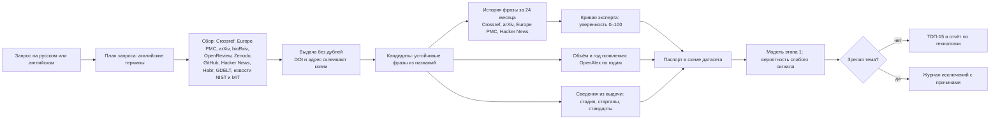

# Как система находит слабые сигналы

Краткая техническая документация: пайплайн обработки данных, методика отбора
признаков и правила исключения. Числа метрик — в
[отчёте этапа 1](signal-model-report.md).

## Схема

Модули: сбор — `app/pilot/approved_sources`, `app/backend/providers`;
кандидаты — `app/radar/phrases.py`; история и кривая —
`app/trend_history.py`, `app/trend_confidence.py`; паспорт и решение —
`app/radar/passport.py`; модель — `app/signal_model`; интерфейс —
`app/ui/radar_view.py`.

## 1. Кандидаты

Кандидат — фраза из 2–4 слов в названиях найденных материалов:

- встречается минимум в 3 материалах из 2 разных источников (или в 5 из одного);
- не совпадает с самим запросом и не заканчивается свойством
  («conductivity», «stability», «performance» — это характеристики, а не технологии);
- рецензии и решения редакции Crossref не считаются: они повторяют название статьи;
- варианты одной фразы склеиваются по совпадению материалов (Жаккар ≥ 0,6),
  а частная технология внутри общей темы остаётся отдельным кандидатом;
- обрывок фразы достраивается словом, которое почти всегда идёт следом.

Фраза сразу служит названием технологии и поисковым запросом для её истории,
поэтому генеративная модель в отборе не участвует и не может выдумать технологию.

## 2. Кривая эксперта

1. Период — 24 завершённых месяца.
2. Для фразы запрашиваются все работы с ней в названии за период.
3. Каждому источнику назначен коэффициент достоверности: научные каталоги 1,0,
   патенты 0,9, препринты 0,85, новости научных организаций 0,6–0,7,
   репозитории 0,5, агрегаторы новостей 0,35, сообщества 0,25.
4. Одна работа, найденная в нескольких источниках, считается один раз — с
   наибольшим коэффициентом; препринт и журнальная версия склеиваются по названию.
5. По месяцам суммируются коэффициенты, ряд сглаживается скользящим средним за
   3 месяца и приближается параболой.
6. Уверенность: ветви вверх и рост к концу периода, R² ≥ 0,9 и не меньше двух
   независимых типов источников — 100. Иначе — R² × 100; спад — 0; меньше 10
   работ или 6 месяцев с работами — «мало данных». Один тип источников даёт не
   больше 60, неполная выдача — не больше 80.

## 3. Модель этапа 1

Логистическая регрессия на двенадцати признаках, заданных заранее по критериям
ТЗ: стадия, динамика, признаки раннего и сформированного рынка, научная
активность, хайп без подтверждений, спад, стандарты, давность, доля свежих
упоминаний, доля крупных корпораций, «не технология». Датасет организаторов
содержит только слабые сигналы, поэтому добавлены 90 отрицательных примеров
команды в той же схеме: зрелые технологии, хайп и шум, по 15 на каждую область.

Для открытого поиска кандидат приводится к схеме датасета фиксированными
правилами: стадия — по словам в найденных текстах (prototype, pilot, deployed)
или «массовое внедрение» для зрелой темы; тренд — по кривой эксперта;
обоснование — из измеренных фактов (год появления, объём, типы источников,
упоминания стартапов и стандартов). К паспорту применяется та же модель,
поэтому объяснение решения одинаково на датасете и на открытом поиске.

## 4. Исключение зрелого, хайпа и шума

- **Массовое внедрение** — жёсткое правило поверх модели: по OpenAlex 5000 работ
  с фразой в названии или 1000 работ старше 10 лет (без OpenAlex — 1000 или
  300 работ по arXiv и Europe PMC).
- **Давно известное понятие** — фраза старше 15 лет без ускорения роста
  (уверенность по кривой ниже 50). Старая идея с новым резким ростом остаётся.
- **Хайп** — упоминания только в медиа и сообществах без научных работ.
- **Спад** — последняя треть периода заметно ниже первой.
- **Шум** — фразы-свойства и сам запрос не становятся кандидатами.

Каждый исключённый кандидат попадает в журнал «Почему не вошли в ТОП» с
причинами и открывается тем же отчётом, что и технология из ТОПа.

## 5. Источники и доверенность

У каждого источника в отчёте указаны название, ссылка, дата, тип, язык и
уровень доверенности: высокий — научные каталоги, патенты, препринты;
средний — новости организаций и репозитории; пониженный — агрегаторы и
сообщества. Пониженная доверенность не может быть единственным основанием:
кандидат без научных работ получает признак хайпа. Выжимки из англоязычных
текстов переведены локальной моделью и помечены «машинный перевод»; оригинал
показан рядом.

## 6. Модели

Все модели работают локально: E5 (соответствие запросу), opus-mt en-ru и ru-en
(перевод), логистическая регрессия этапа 1 (`app/signal_model/model.json`,
веса читаются человеком). Облачные языковые модели не используются.
